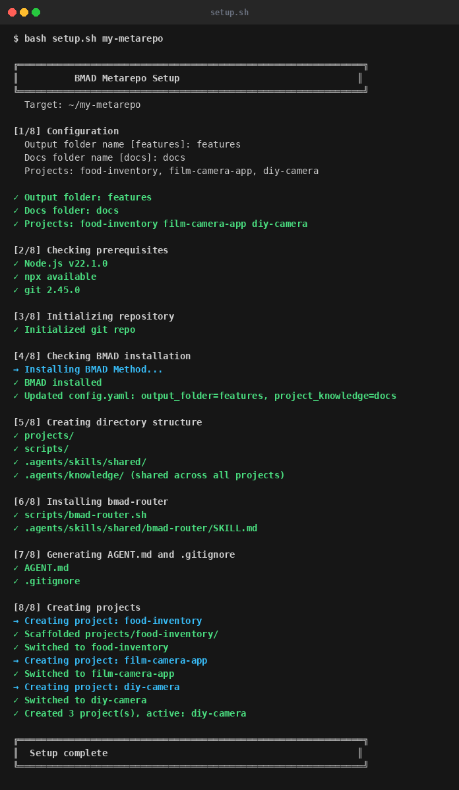
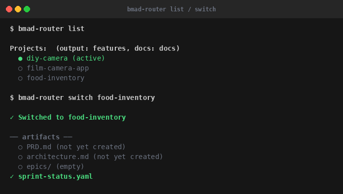
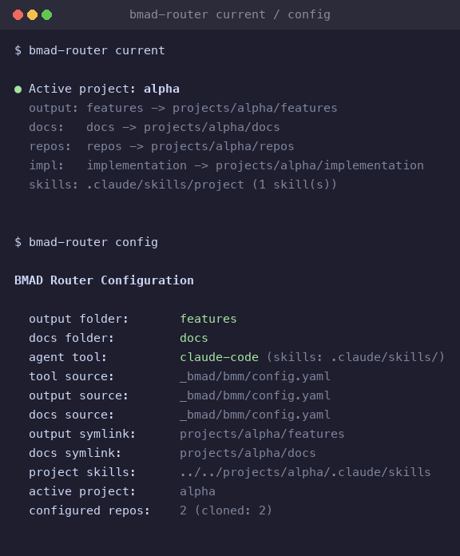
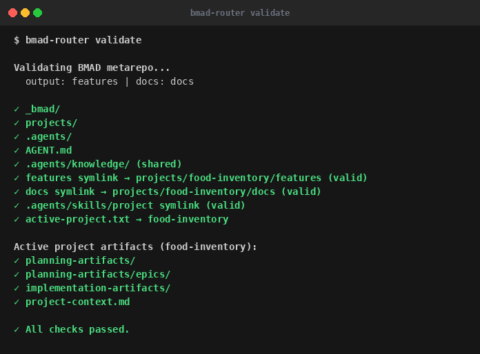

# bmad-router

Run multiple [BMad Method](https://github.com/bmad-code-org/BMAD-METHOD) projects out of one repo. One shared `_bmad/` core, one project active at a time, switched with a symlink swap.

BMAD assumes one project per repo. If several projects share the same agents and workflows, you'd otherwise duplicate `_bmad/` everywhere. This keeps a single core and isolates each project's artifacts.

[Browse a live example →](https://github.com/Code-and-Sorts/bmad-router/tree/example) — a generated metarepo with two projects, sample artifacts, and the worktree setup. Regenerated on every push to `main`.

## Quick start

Requirements: Node.js ≥ 20 (for BMAD), git, bash.

```bash
git clone https://github.com/Code-and-Sorts/bmad-router bmad-router
bash bmad-router/setup.sh my-metarepo
```

Setup asks four things — output folder name (default `features`), docs folder name (default `docs`), which agent tool you use (Claude Code, GitHub Copilot, or Codex), and which projects to create — then installs BMAD and scaffolds everything. After that:

```bash
cd my-metarepo
bash scripts/bmad-router.sh init food-inventory   # create + switch to a project
bash scripts/bmad-router.sh switch camera-app     # change active project
bash scripts/bmad-router.sh list                  # list projects
```



**Non-interactive** (CI/scripts): set `BMAD_SETUP_NONINTERACTIVE=1` and pass answers as env vars.

```bash
BMAD_SETUP_NONINTERACTIVE=1 \
  BMAD_OUTPUT_FOLDER=features BMAD_DOCS_FOLDER=docs \
  BMAD_SETUP_TOOL=claude-code BMAD_SETUP_PROJECTS=alpha,beta \
  bash bmad-router/setup.sh my-metarepo
```

## What switching does

`switch <project>` repoints symlinks at the repo root and writes `active-project.txt`. BMAD reads and writes through them unchanged — nothing is copied or deleted.

| Symlink | points to |
| --- | --- |
| `features/` | `projects/<project>/features/` |
| `docs/` | `projects/<project>/docs/` |
| `<tool-home>/skills/project/` | `projects/<project>/<tool-home>/skills/` |
| `repos/` | `projects/<project>/repos/` |
| `implementation/` | `projects/<project>/implementation/` |

## Layout


- `_bmad/` — shared BMAD core (agents, workflows, tasks), installed once.
- `projects/<name>/features/` — that project's BMAD output: PRD, architecture, epics, stories, sprint status, `project-context.md`.
- `projects/<name>/docs/` — that project's `project_knowledge`.
- `projects/<name>/<tool-home>/skills/` — agent skills that activate only when the project is switched in.
- `<tool-home>/skills/<name>/` — always-active skills (e.g. `router-project-switch`).
- `<tool-home>/knowledge/` — shared docs available to every project.
- `projects/<name>/repos.yaml` — manifest of the project's source repos (tracked). Clones and worktrees are gitignored.
- `AGENTS.md` — root context file for the agent.

The `.claude` directory follows your agent tool: `.github` for Copilot, `.codex` for Codex, `.agents` as a fallback.

## Commands

```bash
bash scripts/bmad-router.sh <command>
```

| Command | Does |
| --- | --- |
| `init <name>` | scaffold and switch to a new project |
| `switch <name>` | change the active project |
| `list` | list projects (active marked, with skill counts) |
| `current` | show active project and symlink targets |
| `config` | show resolved folders, agent tool, and where each came from |
| `validate` | check symlinks, `AGENTS.md`, artifact dirs |
| `repos` / `clone [repo]` | list / clone the project's source repos |
| `worktree <story> [repo...]` | create per-story git worktree(s) |
| `worktree list` / `worktree-rm <story>` | list / remove story worktrees |





## Configuration

Folder names and the agent tool resolve in order: **env var → `_bmad/bmm/config.yaml` → default**. Setup writes your choices into `config.yaml`, so the router picks them up afterward.

| Setting | Env var | config.yaml key | Default |
| --- | --- | --- | --- |
| Output folder | `BMAD_OUTPUT_FOLDER` | `output_folder` | `features` |
| Docs folder | `BMAD_DOCS_FOLDER` | `project_knowledge` | `docs` |
| Agent tool | `BMAD_AGENT_TOOL` | `agent_tool` | `claude-code` |

The agent tool sets where skills and shared knowledge live: `.claude/` (Claude Code), `.github/` (Copilot), `.codex/` (Codex). Setup also points BMAD's `planning_artifacts` / `implementation_artifacts` at your output folder.

## Source repos and worktrees

The metarepo tracks planning artifacts, not source. Each project lists its repos in `repos.yaml`:

```yaml
repos:
  - name: web
    url: git@github.com:you/web.git
    branch: main
  - name: api
    url: git@github.com:you/api.git
    branch: main
```

```bash
bash scripts/bmad-router.sh clone                        # clone all (or: clone web)
bash scripts/bmad-router.sh worktree STORY-001 web api   # one worktree per repo
bash scripts/bmad-router.sh worktree STORY-001 --all     # every repo
bash scripts/bmad-router.sh worktree-rm STORY-001        # tear down
```

Worktrees land at `projects/<name>/implementation/<story-id>/<repo>/` (gitignored), each on branch `story/<story-id>`. A full-stack story can span several repos at once.

Setup wires this into BMAD through `_bmad/custom/`: the scrum master adds an `## Affected Repos` section to each story, and the dev agent reads it to create the worktrees before implementing. See `_bmad/custom/worktree-workflow.md`.

## GitHub Issues sync (optional)

Optional layer that turns ready stories into GitHub Issues. Enable it during setup (or copy `templates/.github` in later). It watches each project's `sprint-status.yaml`: stories that reach `ready` are synced to the project's repo, and issue numbers are written back. Sync is idempotent — each issue carries a hidden `<!-- bmad-sync:STORY:project -->` marker, so re-runs update rather than duplicate.

Per project, add a `github-sync.yaml`:

```yaml
repo: your-username/food-inventory
labels: { epic: epic, story: story, bug: bug }
milestone_prefix: Sprint
```

Create the `epic`/`story`/`bug` labels in the target repo. If it differs from the metarepo, add a PAT with `repo` scope as the `BMAD_ISSUES_TOKEN` secret; otherwise the default `GITHUB_TOKEN` works. Run locally with `python scripts/bmad-issues.py --dry-run` (needs `gh` authenticated).

Status mapping: `draft`/`backlog`/`deferred` → skipped, `ready`/`todo`/`planned`/`in-progress` → open, `done`/`complete`/`shipped`/`cancelled` → closed.

## Notes

- **Symlinks on Windows** need `core.symlinks=true` (WSL works out of the box).
- **All symlinks move together** — no split-brain where output and docs point at different projects.
- **Source is gitignored** — clones (`projects/*/repos/`) and worktrees (`projects/*/implementation/`) aren't tracked; remove those `.gitignore` lines if you want them in.
- **One BMAD version** for all projects, since they share `_bmad/`.
- **Default output folder is `features`, not BMAD's `_bmad-output`** — reads better in a metarepo. Change it during setup or in `config.yaml`.

## Tests

```bash
pip install pytest pyyaml
pytest tests/ -v
```

Router tests in `tests/test_bmad_router.py`, issue-sync tests in `tests/test_bmad_issues.py`. These cover this repo; generated metarepos ship only a shellcheck CI workflow, not the test suite.

## File manifest

```markdown
bmad-router/
├── setup.sh                        # Bootstrap a new metarepo
├── scripts/
│   ├── bmad-router.sh              # Context switcher (copied into metarepo)
│   └── bmad-issues.py              # GitHub Issues sync (optional)
├── templates/
│   ├── .github/workflows/
│   │   ├── ci.yml                  # Metarepo CI (shellcheck), installed into each metarepo
│   │   └── sync-issues.yml         # GitHub Action (optional)
│   ├── bmad-custom/                # BMAD overrides → _bmad/custom/
│   │   ├── bmad-dev-story.toml     #   create per-story worktrees on implement
│   │   ├── bmad-create-story.toml  #   add "## Affected Repos" to stories
│   │   └── worktree-workflow.md    #   the worktree procedure (loaded as context)
│   └── github-sync.yaml            # Per-project sync config template
├── examples/seed/                  # Seed content overlaid onto the example branch
├── .github/workflows/
│   ├── ci.yml                      # pytest + shellcheck (this repo)
│   └── generate-example.yml        # Publishes the example branch on push to main
├── SKILL.md                        # Agent skill definition
├── tests/                          # Router + issue-sync test suites
└── docs/images/                    # README screenshots
```
