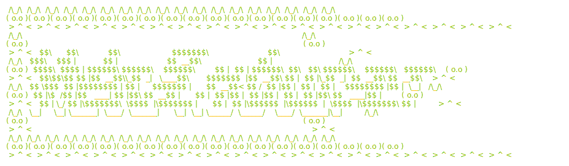

# 

Run multiple [BMad Method](https://github.com/bmad-code-org/BMad-METHOD) workspaces (BMad is an agent-driven planning and development workflow) out of one repo. One shared `_bmad/` core, one workspace active at a time, switched with a symlink swap.

[](https://github.com/Code-and-Sorts/meta-router/actions/workflows/ci.yml)
[](LICENSE)
[](docs/how-it-works.md)

BMad assumes one project per repo. If several workspaces share the same agents and workflows, you'd otherwise duplicate `_bmad/` everywhere. This keeps a single core and isolates each workspace's artifacts.

> Meta Router is an independent tool that builds on the BMad Method; it is not affiliated with or endorsed by the BMad project.

[Browse a live example →](https://github.com/Code-and-Sorts/meta-router/tree/example): a generated metarepo with two workspaces, sample artifacts, and the worktree setup. Regenerated on every push to `main`.

## Quick start

Requirements: Node.js ≥ 20 (for BMad), git, bash. On Windows, set `core.symlinks=true` (WSL works out of the box).

Via the skill: install it, then ask your agent to set up a metarepo; the skill runs setup from wherever it's installed.

```bash
gh skill install Code-and-Sorts/meta-router meta-router
```

Or clone and run setup yourself:

```bash
git clone https://github.com/Code-and-Sorts/meta-router
bash meta-router/skills/meta-router/scripts/setup.sh my-metarepo
```

Setup asks six things: output folder name (default `features`), docs folder name (default `docs`), your BMad skill level, which agent tool you use (Claude Code, GitHub Copilot, or Codex), which workspaces to create, and whether to enable GitHub sync. Then it installs BMad and scaffolds everything. It also runs non-interactively for CI; see the [setup environment variables](docs/reference.md#setup-environment-variables).

After that, drive the metarepo either way.

Use the skill: generated metarepos include the `meta-router` agent skill automatically (scripts and templates ship inside it at `.claude/skills/meta-router/`), so your agent can switch workspaces, cut worktrees, and run the GitHub sync on request. Or call the bundled script directly:

```bash
cd my-metarepo
router=.claude/skills/meta-router/scripts/meta-router.sh   # .github or .codex for other tools
bash $router init food-inventory   # create + switch to a workspace
bash $router switch camera-app     # change active workspace
bash $router list                  # list workspaces
```

`switch` repoints a handful of symlinks at the repo root (`features/`, `docs/`, skills, `repos/`, `implementation/`) so BMad reads and writes the active workspace's artifacts; nothing is copied or deleted.

## Documentation

- [How it works](docs/how-it-works.md): the symlink swap, shared vs. per-workspace context, and the metarepo layout.
- [Reference](docs/reference.md): every `meta-router.sh` command, configuration, setup env vars, and the file manifest.
- [Source repos and worktrees](docs/worktrees.md): declare each workspace's repos in `repos.yaml`, then cut per-story git worktrees across them.
- [GitHub Issues + Projects sync](docs/github-sync.md): optionally mirror BMad artifacts to issue trees and a project board.

## Contributing

Issues and PRs welcome; [CONTRIBUTING.md](CONTRIBUTING.md) covers tests, shellcheck, and PR expectations.
