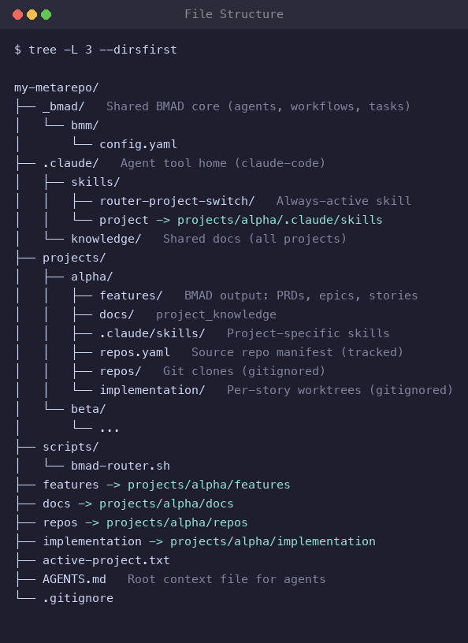

# How it works

Meta Router keeps several BMad projects in one repo by sharing a single `_bmad/` core and swapping which project the agent sees. This page covers the swap, the two context tiers, and the resulting layout.

## The symlink swap

`switch <project>` repoints symlinks at the repo root and writes `active-project.txt`. BMad reads and writes through them unchanged; nothing is copied or deleted.

| Symlink | points to |
| --- | --- |
| `features/` | `projects/<project>/features/` |
| `docs/` | `projects/<project>/docs/` |
| `<tool-home>/skills/project/` | `projects/<project>/<tool-home>/skills/` |
| `repos/` | `projects/<project>/repos/` |
| `implementation/` | `projects/<project>/implementation/` |

All symlinks move together, so there's no split-brain where output and docs point at different projects.

`<tool-home>` follows your agent tool: `.claude` for Claude Code, `.github` for Copilot, `.codex` for Codex, `.agents` as a fallback.

## Two context tiers

**Overall shared context** (`<tool-home>/knowledge/shared-context.md`) holds org-wide standards that apply to every project and is global (it does *not* change on switch). Each project's **`project-context.md`** holds its own conventions and overrides the shared context on conflict. Agents read both before every workflow (BMad loads the shared one via `_bmad/custom/` `persistent_facts`).

## Layout

- `_bmad/`: shared BMad core (agents, workflows, tasks), installed once.
- `projects/<name>/features/`: that project's BMad output, meaning PRD, architecture, epics, stories, sprint status, `project-context.md`.
- `projects/<name>/docs/`: that project's `project_knowledge`.
- `projects/<name>/<tool-home>/skills/`: agent skills that activate only when the project is switched in.
- `<tool-home>/skills/<name>/`: always-active skills (e.g. `router-project-switch`).
- `<tool-home>/knowledge/`: shared docs available to every project.
- `<tool-home>/knowledge/shared-context.md`: overall shared context (org-wide standards) loaded for every project, alongside each project's `project-context.md`.
- `projects/<name>/repos.yaml`: manifest of the project's source repos (tracked). Clones and worktrees are gitignored.
- `AGENTS.md`: root context file for the agent.

## Design notes

- One BMad version serves all projects, since they share `_bmad/`.
- The metarepo tracks planning artifacts, not source. Clones (`projects/*/repos/`) and worktrees (`projects/*/implementation/`) are gitignored; see [worktrees](worktrees.md).
- The default output folder is `features`, not BMad's `_bmad-output`; it reads better in a metarepo. Change it during setup or in `config.yaml` (see [configuration](reference.md#configuration)).
